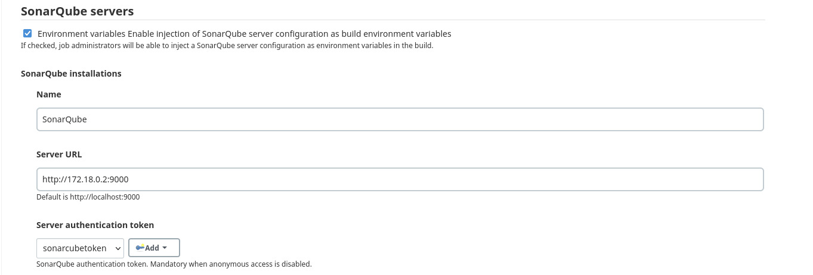

# Run jenkins with sonarqube in docker

based on: https://www.jenkins.io/doc/book/installing/docker/
https://www.jenkins.io/doc/tutorials/build-a-multibranch-pipeline-project/

### Create a custom docker image with blue-ocean and sonar-scanner plugin

- create a file named `Dockerfile` with the following content:

```dockerfile
FROM jenkins/jenkins:lts-jdk11
USER root
RUN apt-get update && apt-get install -y lsb-release
RUN curl -fsSLo /usr/share/keyrings/docker-archive-keyring.asc \
  https://download.docker.com/linux/debian/gpg
RUN echo "deb [arch=$(dpkg --print-architecture) \
  signed-by=/usr/share/keyrings/docker-archive-keyring.asc] \
  https://download.docker.com/linux/debian \
  $(lsb_release -cs) stable" > /etc/apt/sources.list.d/docker.list
RUN apt-get update && apt-get install -y docker-ce-cli
USER jenkins
RUN jenkins-plugin-cli --plugins "blueocean:1.25.5 docker-workflow:1.28 sonar:2.14"
```

- run the following command from the folder containing the `Dockerfile'

```bash
docker build -t jenkins-blueocean:custom .
```

 the image should now be in your docker images list with tag custom

```bash
docker images
```

- Create a bridge network in Docker using the following docker network create command:

```bash
  docker network create mynet
```

- create persistent volumes

```bash
 docker volume create jenkins-data
 docker volume create jenkins-docker-certs
```

- run the new custom container

```bash
docker run \
  --name jenkins \
  --restart unless-stopped \
  --detach \
  --network mynet \
  --env DOCKER_HOST=tcp://docker:2376 \
  --env DOCKER_CERT_PATH=/certs/client \
  --env DOCKER_TLS_VERIFY=1 \
  --env JAVA_OPTS=-Dhudson.plugins.git.GitSCM.ALLOW_LOCAL_CHECKOUT=true \
  --publish 8989:8080 \
  --publish 50000:50000 \
  --volume jenkins-data:/var/jenkins_home \
  --volume jenkins-docker-certs:/certs/client:ro \
  --volume "$HOME":/home \
  jenkins-blueocean:custom
```

Open jenkins in the browser:
http://localhost:8989

- unlock jenkins using the automatically-generated password

```bash
docker exec jenkins cat /var/jenkins_home/secrets/initialAdminPassword
```

- setup admin account
- install recommended plugins

Not really needed as we use persistent volumes:
create new image with the latest state
```bash
docker commit [CONTAINER_ID] [new_image_name]
```
some useful commands

```bash
docker container exec -it container-name bash  
docker container ls 
docker logs container-name
```

# Setup a local git repo

```bash
#Create remote repo
git init --bare ~/repo/remote/docker_jenkins_pipelines.git

#Create local repo
git init docker_jenkins_pipelines
cd docker_jenkins_pipelines
touch .gitignore
git status
git add .
git commit -m "initial commit"
# Connect to remote repo
git remote add origin ~/repo/remote/docker_jenkins_pipelines.git
git push --set-upstream origin master
# set remote url (not needed)
git remote set-url origin ~/repo/remote/docker_jenkins_pipelines.git
```

### allow local git repo

(this seems not reliable, easier to set from docker run as used above)
From Manage Jenkins -> script console:
hudson.plugins.git.GitSCM.ALLOW_LOCAL_CHECKOUT=true

```groovy
System.setProperty("hudson.plugins.git.GitSCM.ALLOW_LOCAL_CHECKOUT", "true")
// and validate
System.getProperty("hudson.plugins.git.GitSCM.ALLOW_LOCAL_CHECKOUT")
```

### Create the pipeline for this repo

In jenkins at "new item" -> select multi pipeline and use this
url for this repo: `/home/repo/remote/docker_jenkins_pipelines.git`

# sonarqube with postgres

### create postgres container

```bash
docker run --restart unless-stopped --name postgres \
  -e POSTGRES_USER=sonar \
  -e POSTGRES_PASSWORD=sonar 
  -d \
  -p 5432:5432 \
  -v /var/data/postgres-data:/var/lib/postgresql/data \
  --net mynet 
  postgres
```

### create sonarqube container   

needed to set max_map_count value because of the following issue in the log (`docker logs sonarqube`)

---
ERROR: [1] bootstrap checks failed
[1]: max virtual memory areas vm.max_map_count [65530] is too low, increase to at least [262144]
ERROR: Elasticsearch did not exit normally - check the logs at /opt/sonarqube/logs/sonarqube.log```
2022.04.29 11:39:33 INFO  es[][o.e.n.Node] stopping ...
---

```bash
sudo sysctl -w vm.max_map_count=262144
```

### run sonarqube container

```bash
docker run --restart unless-stopped \
  --name sonarqube -p 9000:9000 \
  -e SONARQUBE_JDBC_USERNAME=sonar \
  -e SONARQUBE_JDBC_PASSWORD=sonar \
  -e SONARQUBE_JDBC_URL=jdbc:postgresql://postgres:5432/sonar \
  -e SONAR_ES_BOOTSTRAP_CHECKS_DISABLE=true \
  -d \
  --net mynet \
  mc1arke/sonarqube-with-community-branch-plugin:9.5-community
```

open sonarqube and add the project `http://localhost:9000`

# Connect jenkins with sonarqube
when running on the same machine, it is not possible to use localhost:9000 in the jenkins configuration
```
08:33:18.512 ERROR: SonarQube server [http://localhost:9000] can not be reached
08:33:18.512 INFO: ------------------------------------------------------------------------
08:33:18.513 INFO: EXECUTION FAILURE
08:33:18.513 INFO: ------------------------------------------------------------------------
docker ip for sonarqube
```
get the proper docker ipaddress
```bash
docker inspect -f '{{range .NetworkSettings.Networks}}{{.IPAddress}}{{end}}' sonarqube
# result: 172.18.0.2
```

Install sonar scanner plugin in jenkins
and use the ipaddress in jenkins sonarqube configuration




# Upgrading sonarqube with docker image

Stop and remove the existing SonarQube container 
```bash
docker stop sonarqube
docker rm sonarqube
```

docker run with new version, see docker run command [above](#run-sonarqube-container)

Create a backup of the database in case of an error, or want to revert to previous version!
```bash
#backup:
docker exec -t db-container pg_dumpall -c -U db-user > dump_$(date +%Y-%m-%d_%H_%M_%S).sql
#backup compressed:
docker exec -t db-container pg_dumpall -c -U db-user | gzip > ./dump_$(date +"%Y-%m-%d_%H_%M_%S").gz
#restore:
cat dump.sql | docker exec -i db-container psql -U db-user -d db-name
#restore compressed:
gunzip < dump.sql.gz | docker exec -i db-container psql -U db-user -d db-name
```

For this example:
```bash
docker exec -t postgres pg_dumpall -c -U sonar > dump_$(date +%Y-%m-%d_%H_%M_%S).sql
```
restore:
```bash
cat dump.sql | docker exec -i postgres psql -U sonar -d sonar

```

Go to:
```
http://localhost:9000/setup
```
and follow the setup instructions to upgrade the database
as mentioned in:
```
docker logs sonarqube
```

Wait till upgrade is finished and your good to go!
Reanalyze your projects to get fresh data ;)
